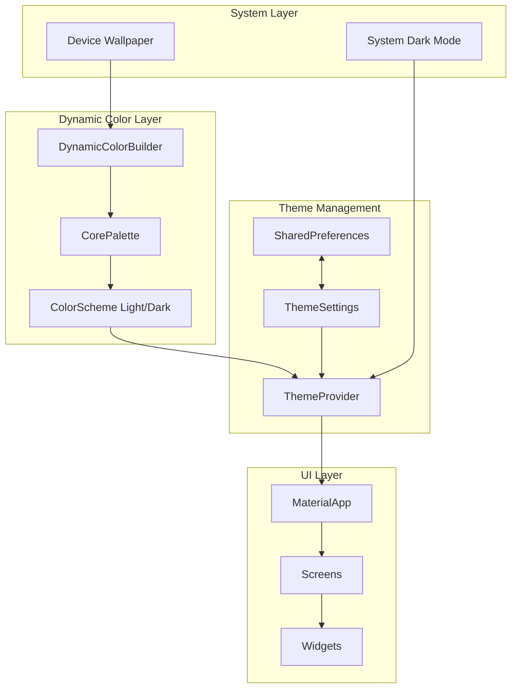

# Design Document: Material Expressive 3 UI Rework

## Overview

Dokumen ini menjelaskan arsitektur dan desain teknis untuk migrasi UI SpotiFLAC Android ke Material Expressive 3 (Material You). Implementasi menggunakan package `dynamic_color` untuk ekstraksi warna wallpaper dan Riverpod untuk state management tema.

## Architecture



## Components and Interfaces

### 1. ThemeSettings Model

```dart
@freezed
class ThemeSettings with _$ThemeSettings {
  const factory ThemeSettings({
    @Default(ThemeMode.system) ThemeMode themeMode,
    @Default(true) bool useDynamicColor,
    @Default(0xFF1DB954) int seedColorValue, // Spotify green fallback
  }) = _ThemeSettings;
  
  factory ThemeSettings.fromJson(Map<String, dynamic> json) => 
      _$ThemeSettingsFromJson(json);
}
```

### 2. ThemeProvider

```dart
@riverpod
class ThemeNotifier extends _$ThemeNotifier {
  @override
  ThemeSettings build() {
    _loadFromStorage();
    return const ThemeSettings();
  }
  
  Future<void> setThemeMode(ThemeMode mode);
  Future<void> setUseDynamicColor(bool value);
  Future<void> setSeedColor(Color color);
  Future<void> _loadFromStorage();
  Future<void> _saveToStorage();
}
```

### 3. AppTheme Class

```dart
class AppTheme {
  static const Color spotifyGreen = Color(0xFF1DB954);
  
  static ThemeData light({
    ColorScheme? dynamicScheme,
    Color? seedColor,
  }) {
    final scheme = dynamicScheme ?? 
        ColorScheme.fromSeed(
          seedColor: seedColor ?? spotifyGreen,
          brightness: Brightness.light,
        );
    
    return ThemeData(
      useMaterial3: true,
      colorScheme: _harmonizeSpotifyGreen(scheme),
      typography: _buildTypography(),
      // ... component themes
    );
  }
  
  static ThemeData dark({
    ColorScheme? dynamicScheme,
    Color? seedColor,
  });
  
  static ColorScheme _harmonizeSpotifyGreen(ColorScheme scheme);
  static Typography _buildTypography();
}
```

### 4. DynamicColorWrapper Widget

```dart
class DynamicColorWrapper extends ConsumerWidget {
  final Widget child;
  
  @override
  Widget build(BuildContext context, WidgetRef ref) {
    final themeSettings = ref.watch(themeNotifierProvider);
    
    return DynamicColorBuilder(
      builder: (ColorScheme? lightDynamic, ColorScheme? darkDynamic) {
        final lightScheme = themeSettings.useDynamicColor && lightDynamic != null
            ? lightDynamic
            : ColorScheme.fromSeed(
                seedColor: Color(themeSettings.seedColorValue),
                brightness: Brightness.light,
              );
        
        final darkScheme = themeSettings.useDynamicColor && darkDynamic != null
            ? darkDynamic
            : ColorScheme.fromSeed(
                seedColor: Color(themeSettings.seedColorValue),
                brightness: Brightness.dark,
              );
        
        return MaterialApp.router(
          theme: AppTheme.light(dynamicScheme: lightScheme),
          darkTheme: AppTheme.dark(dynamicScheme: darkScheme),
          themeMode: themeSettings.themeMode,
          // ...
        );
      },
    );
  }
}
```

## Data Models

### ThemeSettings Persistence

```dart
// Storage keys
const String kThemeModeKey = 'theme_mode';
const String kUseDynamicColorKey = 'use_dynamic_color';
const String kSeedColorKey = 'seed_color';

// Serialization
extension ThemeModeExtension on ThemeMode {
  String toStorageString() => name;
  static ThemeMode fromStorageString(String value) => 
      ThemeMode.values.firstWhere((e) => e.name == value, orElse: () => ThemeMode.system);
}
```

### Component Theme Configurations

```dart
// Button themes
static ButtonThemeData _buttonTheme(ColorScheme scheme) => ButtonThemeData(
  shape: RoundedRectangleBorder(borderRadius: BorderRadius.circular(20)),
);

// Card theme
static CardTheme _cardTheme(ColorScheme scheme) => CardTheme(
  elevation: 0,
  shape: RoundedRectangleBorder(borderRadius: BorderRadius.circular(12)),
  color: scheme.surfaceContainerLow,
);

// AppBar theme
static AppBarTheme _appBarTheme(ColorScheme scheme) => AppBarTheme(
  elevation: 0,
  scrolledUnderElevation: 3,
  backgroundColor: scheme.surface,
  foregroundColor: scheme.onSurface,
);

// Navigation bar theme
static NavigationBarThemeData _navigationBarTheme(ColorScheme scheme) => NavigationBarThemeData(
  elevation: 0,
  backgroundColor: scheme.surfaceContainer,
  indicatorColor: scheme.secondaryContainer,
);

// Input decoration theme
static InputDecorationTheme _inputDecorationTheme(ColorScheme scheme) => InputDecorationTheme(
  filled: true,
  fillColor: scheme.surfaceContainerHighest,
  border: OutlineInputBorder(
    borderRadius: BorderRadius.circular(12),
    borderSide: BorderSide.none,
  ),
);

// List tile theme
static ListTileThemeData _listTileTheme(ColorScheme scheme) => ListTileThemeData(
  shape: RoundedRectangleBorder(borderRadius: BorderRadius.circular(12)),
);

// Dialog theme
static DialogTheme _dialogTheme(ColorScheme scheme) => DialogTheme(
  shape: RoundedRectangleBorder(borderRadius: BorderRadius.circular(28)),
  backgroundColor: scheme.surfaceContainerHigh,
);
```


## Correctness Properties

*A property is a characteristic or behavior that should hold true across all valid executions of a system—essentially, a formal statement about what the system should do. Properties serve as the bridge between human-readable specifications and machine-verifiable correctness guarantees.*

### Property 1: ColorScheme Generation from Seed

*For any* valid Color value used as a seed, generating a ColorScheme using `ColorScheme.fromSeed()` SHALL produce a non-null ColorScheme with both light and dark brightness variants that contain all required Material 3 color roles.

**Validates: Requirements 1.4**

### Property 2: Fallback Behavior Consistency

*For any* ThemeSettings where `useDynamicColor` is false OR when dynamic ColorScheme is null (Android < 12), the resulting theme SHALL use the `seedColorValue` from ThemeSettings to generate the ColorScheme.

**Validates: Requirements 1.3, 1.5**

### Property 3: Theme Settings Persistence Round-Trip

*For any* valid ThemeSettings object, saving it to SharedPreferences and then loading it back SHALL produce an equivalent ThemeSettings object with identical `themeMode`, `useDynamicColor`, and `seedColorValue` values.

**Validates: Requirements 2.3, 2.4**

### Property 4: ColorScheme Completeness

*For any* generated ColorScheme (whether from dynamic color or seed), all required color roles SHALL be non-null: primary, onPrimary, primaryContainer, onPrimaryContainer, secondary, onSecondary, secondaryContainer, onSecondaryContainer, tertiary, onTertiary, tertiaryContainer, onTertiaryContainer, error, onError, errorContainer, onErrorContainer, surface, onSurface, surfaceContainerLowest, surfaceContainerLow, surfaceContainer, surfaceContainerHigh, surfaceContainerHighest.

**Validates: Requirements 4.1**

### Property 5: Color Harmonization Shift

*For any* ColorScheme and the Spotify green color (#1DB954), harmonizing the green with the scheme's primary color SHALL produce a color whose hue is shifted towards the primary color's hue while maintaining recognizable green characteristics.

**Validates: Requirements 4.5**

### Property 6: Color Contrast Compliance

*For any* generated ColorScheme, the contrast ratio between `onSurface` and `surface` SHALL be at least 4.5:1, and the contrast ratio between `onPrimary` and `primary` SHALL be at least 4.5:1, ensuring WCAG 2.1 AA compliance for normal text.

**Validates: Requirements 4.6, 10.1, 10.2**

## Error Handling

### Dynamic Color Unavailable

```dart
DynamicColorBuilder(
  builder: (ColorScheme? lightDynamic, ColorScheme? darkDynamic) {
    // Graceful fallback when dynamic color is unavailable
    final useFallback = lightDynamic == null || darkDynamic == null;
    
    if (useFallback) {
      // Log for debugging
      debugPrint('Dynamic color unavailable, using fallback seed color');
    }
    
    // Continue with fallback ColorScheme
    return _buildApp(
      lightScheme: lightDynamic ?? _fallbackLightScheme,
      darkScheme: darkDynamic ?? _fallbackDarkScheme,
    );
  },
);
```

### Storage Errors

```dart
Future<void> _loadFromStorage() async {
  try {
    final prefs = await SharedPreferences.getInstance();
    final modeString = prefs.getString(kThemeModeKey);
    final useDynamic = prefs.getBool(kUseDynamicColorKey);
    final seedColor = prefs.getInt(kSeedColorKey);
    
    state = ThemeSettings(
      themeMode: modeString != null 
          ? ThemeModeExtension.fromStorageString(modeString) 
          : ThemeMode.system,
      useDynamicColor: useDynamic ?? true,
      seedColorValue: seedColor ?? 0xFF1DB954,
    );
  } catch (e) {
    // Use defaults on error
    debugPrint('Error loading theme settings: $e');
    state = const ThemeSettings();
  }
}
```

### Invalid Color Values

```dart
Color _validateSeedColor(int colorValue) {
  // Ensure alpha is fully opaque
  final color = Color(colorValue);
  if (color.alpha < 255) {
    return color.withAlpha(255);
  }
  return color;
}
```

## Testing Strategy

### Unit Tests

Unit tests akan memverifikasi:
- ThemeSettings serialization/deserialization
- ColorScheme generation dari berbagai seed colors
- Theme mode persistence logic
- Color harmonization calculations
- Contrast ratio calculations

### Property-Based Tests

Property-based tests menggunakan `fast_check` package untuk Dart:

```dart
// Example property test structure
import 'package:fast_check/fast_check.dart';

void main() {
  group('ColorScheme Properties', () {
    test('Property 1: ColorScheme generation from any seed', () {
      fc.assert(
        fc.property(
          fc.integer(min: 0xFF000000, max: 0xFFFFFFFF),
          (seedValue) {
            final color = Color(seedValue).withAlpha(255);
            final lightScheme = ColorScheme.fromSeed(
              seedColor: color,
              brightness: Brightness.light,
            );
            final darkScheme = ColorScheme.fromSeed(
              seedColor: color,
              brightness: Brightness.dark,
            );
            
            expect(lightScheme, isNotNull);
            expect(darkScheme, isNotNull);
            expect(lightScheme.brightness, Brightness.light);
            expect(darkScheme.brightness, Brightness.dark);
          },
        ),
        numRuns: 100,
      );
    });
    
    test('Property 3: Theme settings round-trip', () {
      fc.assert(
        fc.property(
          fc.record({
            'themeMode': fc.constantFrom([ThemeMode.light, ThemeMode.dark, ThemeMode.system]),
            'useDynamicColor': fc.boolean(),
            'seedColor': fc.integer(min: 0xFF000000, max: 0xFFFFFFFF),
          }),
          (record) async {
            final original = ThemeSettings(
              themeMode: record['themeMode'] as ThemeMode,
              useDynamicColor: record['useDynamicColor'] as bool,
              seedColorValue: record['seedColor'] as int,
            );
            
            // Save
            final prefs = await SharedPreferences.getInstance();
            await prefs.setString(kThemeModeKey, original.themeMode.name);
            await prefs.setBool(kUseDynamicColorKey, original.useDynamicColor);
            await prefs.setInt(kSeedColorKey, original.seedColorValue);
            
            // Load
            final loaded = ThemeSettings(
              themeMode: ThemeModeExtension.fromStorageString(
                prefs.getString(kThemeModeKey)!,
              ),
              useDynamicColor: prefs.getBool(kUseDynamicColorKey)!,
              seedColorValue: prefs.getInt(kSeedColorKey)!,
            );
            
            expect(loaded.themeMode, original.themeMode);
            expect(loaded.useDynamicColor, original.useDynamicColor);
            expect(loaded.seedColorValue, original.seedColorValue);
          },
        ),
        numRuns: 100,
      );
    });
    
    test('Property 6: Contrast ratio compliance', () {
      fc.assert(
        fc.property(
          fc.integer(min: 0xFF000000, max: 0xFFFFFFFF),
          (seedValue) {
            final color = Color(seedValue).withAlpha(255);
            final scheme = ColorScheme.fromSeed(seedColor: color);
            
            final surfaceContrast = _calculateContrastRatio(
              scheme.onSurface,
              scheme.surface,
            );
            final primaryContrast = _calculateContrastRatio(
              scheme.onPrimary,
              scheme.primary,
            );
            
            expect(surfaceContrast, greaterThanOrEqualTo(4.5));
            expect(primaryContrast, greaterThanOrEqualTo(4.5));
          },
        ),
        numRuns: 100,
      );
    });
  });
}

double _calculateContrastRatio(Color foreground, Color background) {
  final l1 = _relativeLuminance(foreground);
  final l2 = _relativeLuminance(background);
  final lighter = l1 > l2 ? l1 : l2;
  final darker = l1 > l2 ? l2 : l1;
  return (lighter + 0.05) / (darker + 0.05);
}

double _relativeLuminance(Color color) {
  double channel(int value) {
    final v = value / 255;
    return v <= 0.03928 ? v / 12.92 : pow((v + 0.055) / 1.055, 2.4).toDouble();
  }
  return 0.2126 * channel(color.red) +
         0.7152 * channel(color.green) +
         0.0722 * channel(color.blue);
}
```

### Widget Tests

Widget tests akan memverifikasi:
- DynamicColorWrapper renders correctly
- Theme changes propagate to child widgets
- Settings screen controls work correctly
- Navigation uses correct theme colors

### Integration Tests

Integration tests akan memverifikasi:
- Full app theme switching flow
- Persistence across app restarts
- Dynamic color updates (on supported devices)

## Dependencies

Tambahkan ke `pubspec.yaml`:

```yaml
dependencies:
  dynamic_color: ^1.7.0
  material_color_utilities: ^0.11.1

dev_dependencies:
  fast_check: ^0.0.5
```

